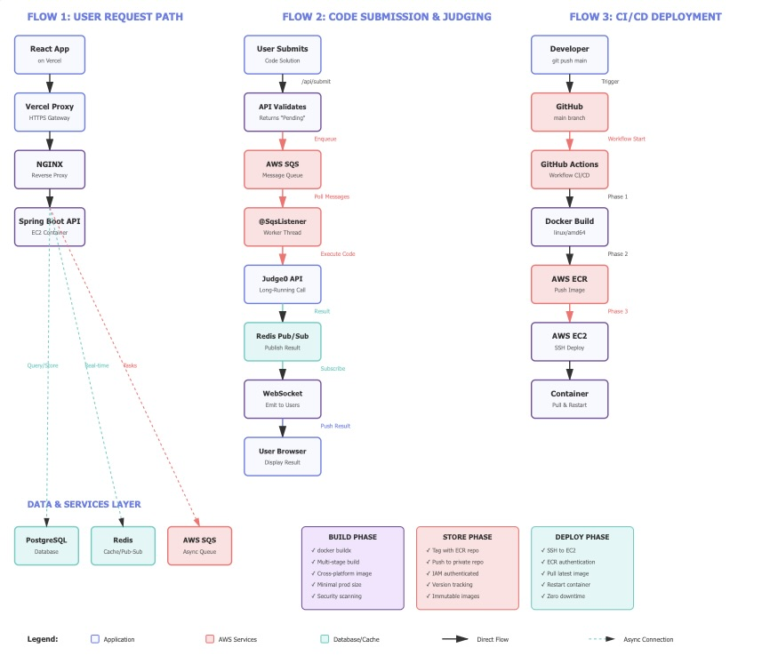

# Code Duel: A Real-Time 1v1 Competitive Programming Platform

Code Duel is a cloud native full-stack, real-time web application where users are matched for one-on-one Data Structures and Algorithms (DSA) challenges. Built on a modern, decoupled, and event-driven architecture, this project is designed for high scalability, security, and real-time performance. Deployed on AWS with NGINX reverse proxy and automated CI/CD pipelines.

## Live Demo

**You can try the live application here: [https://coding-platform-uyo1.vercel.app/](https://coding-platform-uyo1.vercel.app/)**

---

---

## Deployment & Cloud Architecture

This project is deployed using a hybrid-cloud model, demonstrating a professional DevOps workflow with a focus on automation, security, and scalability.

* **Frontend (Vercel):** The React application is deployed to **Vercel**, leveraging its global CDN for high-performance static asset delivery and seamless Git integration. The Vercel project is configured to act as a **secure proxy**, routing all API (`/api/**`) and WebSocket (`/ws/**`) requests to the backend. This provides a unified API gateway for the client and solves all CORS and "Mixed Content" (HTTPS/HTTP) browser issues.

* **Backend (AWS & Docker):** The Spring Boot application is **containerized with Docker** and runs on an **AWS EC2** instance.

* **Networking & Security (NGINX):** On the EC2 instance, **NGINX** is configured as a **reverse proxy** and **SSL termination** point. It handles all incoming HTTPS traffic, manages SSL certificates, and forwards validated requests to the Spring Boot Docker container, which runs in an isolated network.

* **CI/CD Pipeline (GitHub Actions):** The entire backend deployment is fully automated. A **GitHub Actions** workflow triggers on every push to the `main` branch:
    1.  **Build:** A **cross-platform `linux/amd64` Docker image** is built using `docker buildx` (solving M1/M2-to-EC2 build conflicts) from a multi-stage Dockerfile for a minimal, secure production image.
    2.  **Store:** The new image is tagged and pushed to a private **AWS ECR (Elastic Container Registry)** repository.
    3.  **Deploy:** The workflow securely SSHs into the EC2 instance, authenticates with ECR, pulls the new image, and restarts the container for a seamless update.

* **Cloud Services & Configuration:**
    * **AWS IAM (Identity and Access Management):** IAM roles are attached to the EC2 instance and used by the GitHub Actions runner, providing secure, keyless access to other AWS services (like SQS, S3, and ECR) based on the principle of least privilege.
    * **AWS CloudWatch:** Used for logging and monitoring of the EC2 instance and Lambda functions, providing visibility into application health and performance.
    * **Secret Management:** A two-tiered strategy is used: **GitHub Actions Secrets** store CI/CD credentials (AWS keys, SSH keys), while an **`.env` file** on the EC2 server securely injects runtime secrets (database URLs, JWT keys) into the container at runtime.

---

## Technical Highlights & System Design

This project was built with a focus on modern, scalable, and secure system design patterns. The following sections detail the design decisions for the most complex features.

### 1. Asynchronous Code Judging (High Scalability & Responsiveness)

* **Problem:** The external code-judging API can take several seconds to execute a submission. A synchronous request would block the main API thread, severely limiting throughput and creating a poor user experience.
* **Solution:** The system is decoupled using a message queue.
    1.  When a user submits code, the API endpoint (`/api/submit`) validates the request and immediately places it as a message in an **AWS SQS (Simple Queue Service)** queue.
    2.  The API returns a "Pending" response to the user instantly.
    3.  A separate `@SqsListener` in the Spring Boot backend (running on a different thread) consumes messages from this queue, makes the long-running call to the Judge0 API, and processes the result.
    4.  Messages are sent to SQS using `@TransactionalEventListener(phase = AFTER_COMMIT)`, ensuring the submission exists in the database before the worker attempts to process it—eliminating race conditions.
* **Result:** This architecture allows the API to handle large bursts of submissions without slowing down. It provides high throughput and resilience, as failed jobs can be automatically retried by SQS.

### 2. Real-Time Event System (WebSockets & Redis Pub/Sub)

* **Problem:** Once the asynchronous judging is complete (in the SQS worker), the result must be pushed instantly to both competing users. The system also needs to broadcast other match-state events (e.g., opponent found, timer ticks) in real-time.
* **Solution:** A combination of Spring WebSockets and **Redis Pub/Sub**.
    1.  Clients maintain a persistent WebSocket (STOMP over SockJS) connection to the server.
    2.  **Redis** is used as a high-speed message broker, not just a cache.
    3.  When the SQS worker (from point 1) receives a judging result, it publishes that result to a specific Redis topic (e.g., `match:123:results`).
    4.  The main Spring Boot application, which manages the WebSocket connections, is *subscribed* to these Redis topics. It instantly receives the message and forwards it to the correct users over their specific WebSocket connection.
* **Result:** This pattern effectively connects the asynchronous backend workers (SQS listeners) to the real-time frontend clients, a non-trivial challenge in distributed systems.

### 3. Event-Driven File Uploads (Security & Decoupling)

* **Problem:** Allowing problem setters to upload large test case `.zip` files directly to the API server is inefficient, insecure, and burdens the EC2 instance's network and disk I/O.
* **Solution:** A secure, serverless, event-driven pattern that completely bypasses the application server.
    1.  The problem-setter's client requests an upload URL from the API.
    2.  The backend generates and returns a secure, short-lived **AWS S3 Pre-Signed URL** (15-minute expiry), granting temporary write-only access to a specific key in an **AWS S3** bucket.
    3.  The client uploads the `.zip` file *directly* to S3, bypassing the backend entirely.
    4.  The S3 bucket is configured with event notifications. Upon a new file upload (`s3:ObjectCreated:*`), it emits an event.
    5.  This event triggers an **AWS Lambda** function, which validates the file and calls a secure internal API endpoint to transition the problem status from `PENDING_TEST_CASES` to `PUBLISHED` in the database.
* **Result:** This is a highly secure and scalable cloud-native pattern that offloads all file-handling logic from the main application, reduces server load, and leverages managed AWS services.

### 4. Advanced Security (RBAC & ABAC)

* **Problem:** The application requires a security model more granular than simple authentication. For example, a `PROBLEM_SETTER` should only be able to edit problems they have explicit permission to modify.
* **Solution:** A multi-layered security model using **Spring Security**.
    * **Role-Based Access Control (RBAC):** Defines three distinct roles (`ROLE_USER`, `ROLE_ADMIN`, `ROLE_PROBLEM_SETTER`). API endpoints are secured using method-level annotations (e.g., `@PreAuthorize("hasRole('ADMIN')")`) to restrict access based on these static roles.
    * **Attribute-Based Access Control (ABAC):** For more granular control, the system uses custom Spring Expression Language (SpEL) security expressions and three sub-permissions: `CREATE_PROBLEM`, `UPDATE_PROBLEM`, and `DELETE_PROBLEM`. These permissions are granted by the admin on a per-operation basis and automatically expire after use or after 45 minutes.
        * **Example:** A method to edit a problem is secured with `@PreAuthorize("@problemSecurityService.canUpdate(principal, #problemId)")`. This expression calls a bean at runtime to verify both the user's permission and the specific problem authorization.

### 5. Concurrency & Data Consistency

* **Challenge:** Multiple concurrent requests (e.g., two users joining the same match, or a submission completing at the exact moment a match times out) can create race conditions.
* **Solution:** Multi-layered protection ensures data integrity.
    * **Database Transactions:** All critical operations are wrapped in `@Transactional` blocks. Spring Data JPA's row-level locking prevents concurrent modifications to the same `Match` or `UserStats` record.
    * **Idempotent State Checks:** Match completion logic first checks if the match is already `COMPLETED` before proceeding, ensuring double-processing never occurs.
    * **Optimistic Locking:** The `UserStats` entity uses a `@Version` field, causing conflicts to be detected and retried rather than silently losing updates.
* **Result:** The system handles high concurrency gracefully, with zero data corruption even under race conditions.

### 6. Performance Optimizations

* **Test Case Caching:** After parsing `.zip` files from S3, test cases are cached in Redis with a 30-minute TTL. Subsequent submissions for the same problem read from Redis, dramatically reducing S3 data transfer costs and latency.
* **Direct S3 Uploads:** By using pre-signed URLs, large file uploads bypass the EC2 instance entirely, preventing bandwidth bottlenecks.
* **SQS Buffering:** The message queue absorbs submission spikes, allowing the backend to process them at a sustainable rate without scaling infrastructure.
* **Redis for Match State:** Live match data (scores, timer, submissions) is stored in Redis for sub-millisecond read/write performance, with the database serving as the durable source of truth.

---

## Problem Creation Workflow

The system enforces a strict, time-bound workflow for adding new problems:

1. **Admin grants permission:** The admin promotes a user to `PROBLEM_SETTER` and grants a specific sub-permission (e.g., `CREATE_PROBLEM`). This permission expires after 45 minutes if unused.
2. **Submit metadata:** The problem-setter provides the problem title, description, constraints, and exactly 2 sample test cases via the API.
3. **Backend stores as pending:** The problem is saved with status `PENDING_TEST_CASES`, and the backend returns a pre-signed S3 URL (valid for 15 minutes).
4. **Upload large test cases:** The problem-setter uploads a `.zip` file containing hidden test cases directly to S3.
5. **Lambda processes upload:** S3 triggers a Lambda function, which notifies the backend to mark the problem as `PUBLISHED`.
6. **Permission revokes:** Once the problem is created, the user's `CREATE_PROBLEM` permission is automatically revoked, returning them to `ROLE_USER`.
7. **Cleanup job:** A daily cron job (runs at 4 AM) deletes any problems still in `PENDING_TEST_CASES` status, ensuring orphaned records don't accumulate.

---

## Core Application Features

* **Secure Google OAuth 2.0 Login:** Seamless and secure user registration and login using Google accounts.
* **Stateless JWT Authentication:** Robust session management using JSON Web Tokens with a secure refresh token rotation system.
* **Two-Factor Authentication (2FA):** Optional 2FA can be enabled or disabled by users for enhanced account security.
* **1-vs-1 Matchmaking:** Users create match rooms with customizable difficulty ranges and time limits. Once an opponent joins, a problem neither user has solved is selected, ensuring fairness.
* **Real-Time Code Editor:** A Monaco-based code editor supports C++, Java, and Python with syntax highlighting.
* **Instant Submission Results:** Asynchronous code judging delivers results (`Accepted`, `Wrong Answer`, `Time Limit Exceeded`, etc.) instantly to both users' browsers via WebSockets.
* **Automatic Match Completion:** If neither user solves the problem, the match auto-completes when the timer expires, updating stats for both participants.

---

## Tech Stack

| Category | Technology |
| :--- | :--- |
| **Frontend** | **React (Vite)**, TypeScript, **StompJS/SockJS**, **Monaco Editor**, Tailwind CSS |
| **Backend** | **Spring Boot 3**, **Java 21**, **Spring Security 6** (JWT, OAuth2) |
| **Data & Cache** | **PostgreSQL** (Neon DB), **Redis** (Upstash) |
| **Cloud (AWS)** | **EC2**, **S3**, **SQS**, **Lambda**, **ECR**, **IAM**, **CloudWatch** |
| **Deployment** | **Docker** (`buildx`), **NGINX**, **Vercel** (Proxy), **GitHub Actions (CI/CD)** |
| **Code Judging** | **Judge0 API** (via RapidAPI) |
