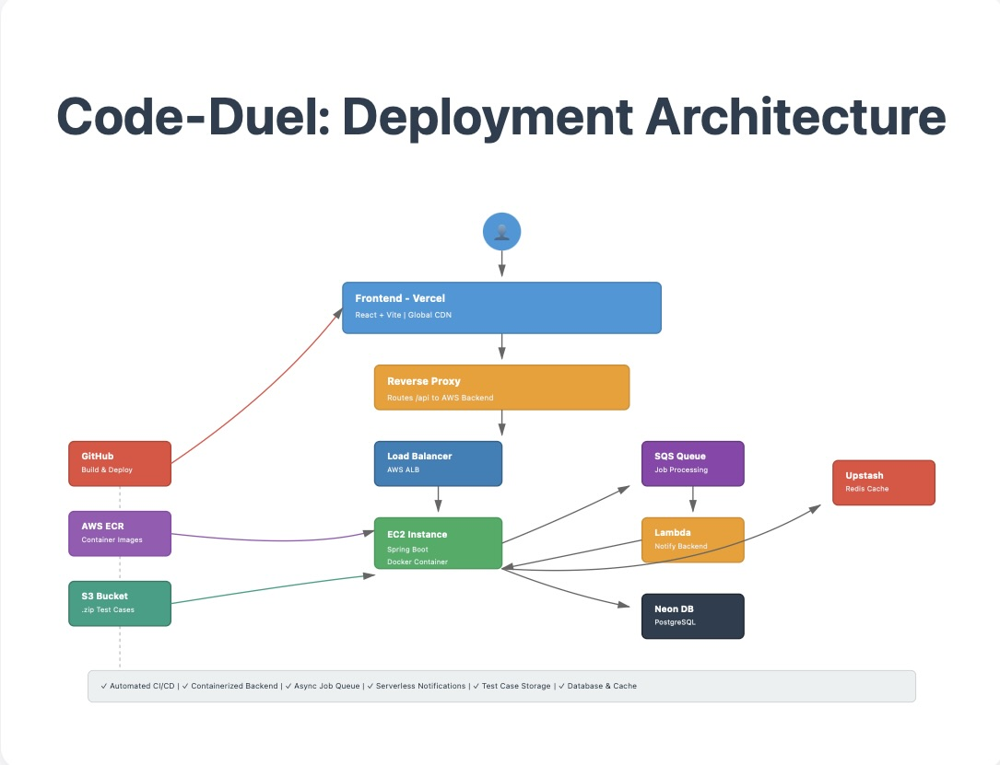

# Code Duel: A Real-Time 1v1 Competitive Programming Platform

Code Duel is a full-stack, real-time web application where users are matched for one-on-one Data Structures and Algorithms (DSA) challenges. Built on a modern, decoupled, and event-driven architecture, this project is designed for high scalability, security, and real-time performance.

##  Live Demo

**You can try the live application here: [https://coding-platform-uyo1.vercel.app/](https://coding-platform-uyo1.vercel.app/)**

##  Core Features

* **Secure Google OAuth 2.0 Login**: Users can register and log in seamlessly and securely using their Google accounts.
* **Stateless JWT Authentication**: Sessions are managed using stateless JSON Web Tokens (JWTs), with a robust refresh token rotation system for enhanced security.
* **1-vs-1 Matchmaking**: Users can enter a matchmaking pool and be paired with another user to compete on a randomly selected problem.
* **Real-Time Code Editor & Sync**: A shared, real-time code editor allows both competitors to see their code.
* **Instant Submission Results**: Code submissions are judged asynchronously, and results (`Accepted`, `Wrong Answer`, etc.) are delivered instantly to the user's browser via WebSockets.

---

##  Technical Highlights & Architecture

This project was built with a focus on modern, scalable, and secure system design. The most complex features are highlighted below.

### 1. Asynchronous Code Judging (High Scalability)

To ensure the API remains fast and responsive, code submissions are not processed on the main web server thread.

* **Problem:** The external **Judge0 API** can take several seconds to execute code. A traditional synchronous request would block the API, leading to a poor user experience and low throughput.
* **Solution:** Submissions are decoupled using a message queue.
    1.  The user's API request (`/api/submit`) is validated and immediately placed as a message in an **AWS SQS** queue.
    2.  An `@SqsListener` in a separate thread on the Spring Boot backend consumes messages from this queue, calls the Judge0 API, and processes the result.
    3.  The result is then published to a **Redis** Pub/Sub topic and pushed to the user via WebSockets.
* **Result:** This pattern provides instant API responses for the user and makes the system highly resilient and scalable, as it can handle large bursts of submissions without slowing down.

### 2. Advanced Security (RBAC & ABAC)

The application implements a multi-layered security model using **Spring Security** to go beyond simple authentication.

* **Role-Based Access Control (RBAC):** Defines three distinct roles (`ROLE_USER`, `ROLE_ADMIN`, `ROLE_PROBLEM_SETTER`). API endpoints are secured using method-level annotations (e.g., `@PreAuthorize("hasRole('ADMIN')")`) to restrict access based on these roles.
* **Attribute-Based Access Control (ABAC):** For more granular control, the system uses custom security expressions. This allows for dynamic, context-aware authorization.
    * **Example:** A `PROBLEM_SETTER` can only edit or delete a problem *if* they are the original author of that problem. This is checked at the method level using `@PreAuthorize("@problemSecurityService.isOwner(principal, #problemId)")`, which is far more flexible than static roles.

### 3. Real-Time WebSocket Communication

The entire match and submission flow is powered by a real-time event system.

* The backend uses **Spring WebSockets** with **STOMP** over **SockJS** to manage persistent, bi-directional communication.
* All match events (e.g., opponent found, countdown timer ticks, submission results, match end) are pushed from the server to the client, ensuring the UI is always in sync for both players without a single manual refresh.
* A custom `SecurityFilterChain` was implemented to bypass JWT authentication for the initial WebSocket handshake while securing the main application, solving complex CORS and `X-Frame-Options` issues.

### 4. Decoupled Event-Driven File Handling

To handle large test case file uploads for new problems, the application uses a secure, event-driven pattern.

1.  A `PROBLEM_SETTER` requests an upload URL from the API.
2.  The backend generates a secure, short-lived **AWS S3 Pre-Signed URL** and returns it.
3.  The client uploads the `.zip` file directly to S3, bypassing the backend server entirely.
4.  The S3 bucket, upon receiving the new file, emits an event that triggers an **AWS Lambda** function.
5.  The Lambda function validates the file and calls a secure internal API endpoint (`/api/internal/...`) to finalize the problem, linking the test cases and publishing the problem.

---

##  Tech Stack

| Category | Technology |
| :--- | :--- |
| **Frontend** | **React (Vite)**, TypeScript, **StompJS/SockJS**, Tailwind CSS, HTML |
| **Backend** | **Spring Boot 3**, **Java 21**, **Spring Security 6** (JWT, OAuth2) |
| **Data & Cache** | **PostgreSQL** (hosted on Neon DB), **Redis** (hosted on Upstash) |
| **Cloud (AWS)** | **EC2**, **S3**, **SQS**, **Lambda**, **ALB**, **ECR**, IAM, CloudWatch |
| **Deployment** | **Docker** (`buildx`), **Vercel** (with Serverless Function proxy), **GitHub Actions (CI/CD)** |

---

##  Deployment & CI/CD Pipeline

The project is deployed using a hybrid cloud model, demonstrating a practical understanding of a professional DevOps workflow.

* **Frontend**: Deployed to **Vercel**. A `vercel.json` file handles SPA routing and acts as a **secure proxy** for all API and WebSocket traffic, solving all "Mixed Content" (HTTPS/HTTP) browser errors.
* **Backend**: The Spring Boot application is **containerized with Docker** and runs on an **AWS EC2** instance, managed by an Application Load Balancer.
* **CI/CD Pipeline**: A **GitHub Actions** workflow is configured to:
    1.  Trigger on any push to the `main` branch.
    2.  Build a **cross-platform `linux/amd64` Docker image** (solving the Mac M1-to-EC2 build conflict).
    3.  Push the new image to a private **AWS ECR** repository.

For a detailed breakdown of the cloud infrastructure, IAM policies, and the step-by-step debugging process, please see **[DEPLOYMENT.md](DEPLOYMENT.md)**.