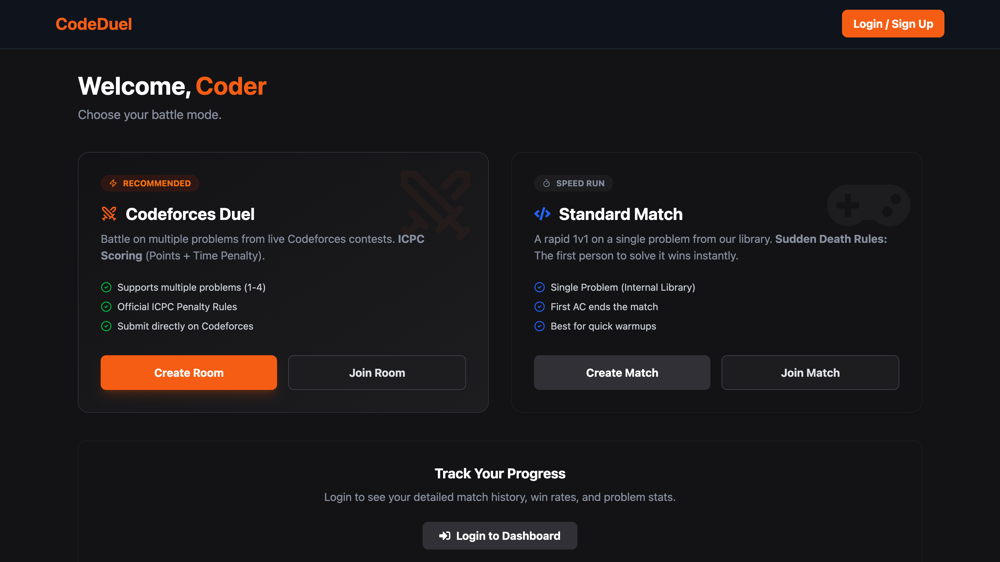
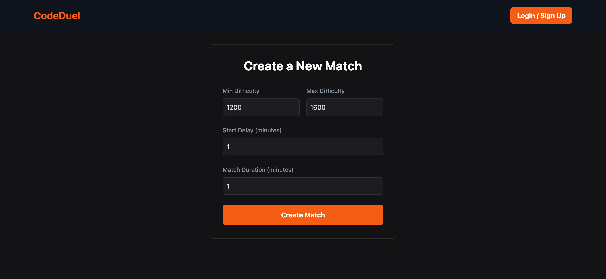
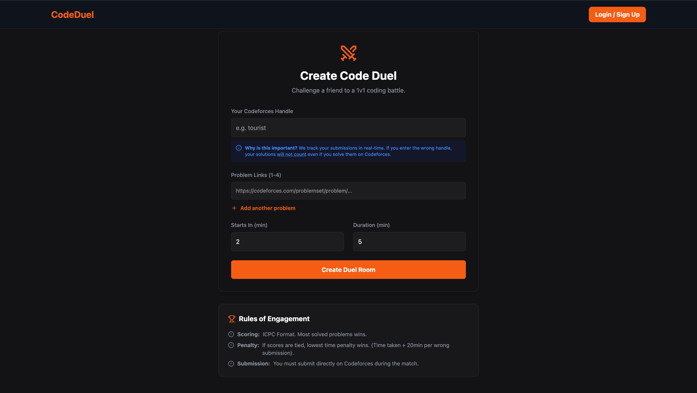
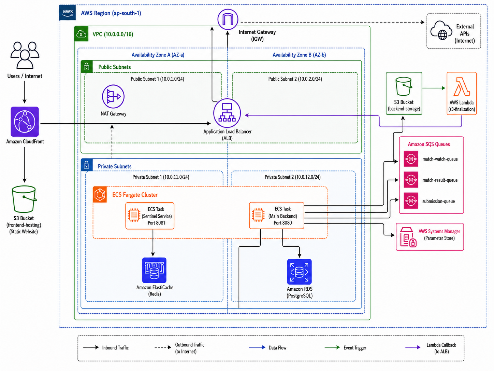
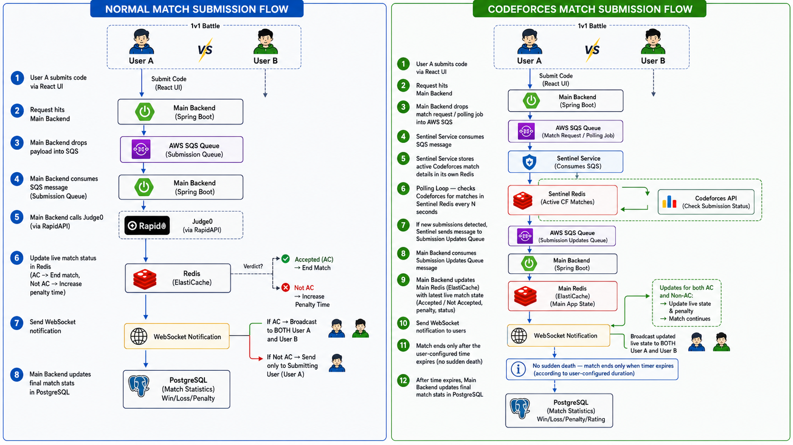
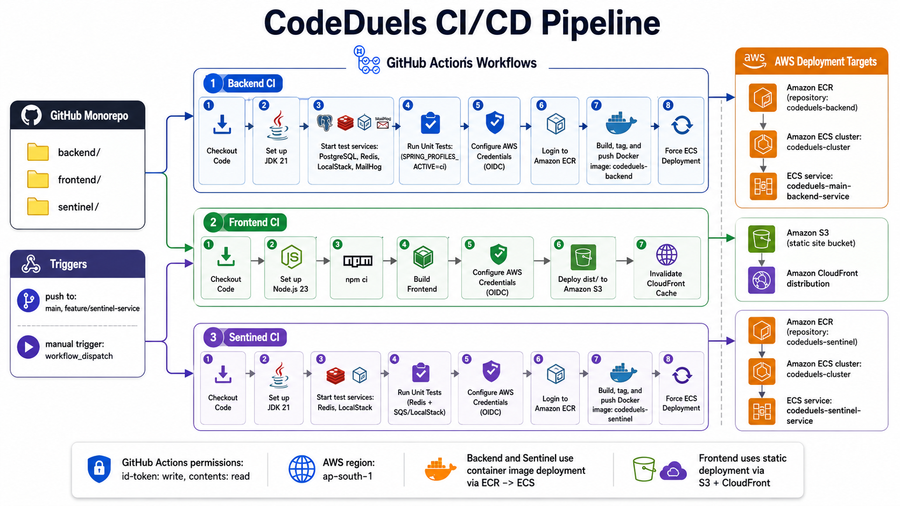

# CodeDuels: Real Time 1v1 Competitive Programming Platform

CodeDuels is a full stack, real time competitive programming platform where users compete in one on one DSA battles with live matchmaking, code execution, real time result updates, and performance tracking.

The platform has served **2,000+ registered users** and evolved from a manually deployed AWS application into a **Terraform managed, ECS based, microservice oriented cloud architecture** using AWS SQS, ElastiCache Redis, RDS PostgreSQL, CloudFront, S3, Lambda, GitHub Actions, and AWS ECS Fargate.

> Built to explore real world backend engineering concepts such as asynchronous processing, real time communication, cloud deployment, infrastructure as code, CI/CD, authentication, authorization, and distributed service communication.

---

## Live Demo & Deployment Status

> **Cost-Aware Architecture:** The live AWS deployment (ECS Fargate, RDS, ElastiCache) is currently paused to optimize cloud costs. The infrastructure is managed via Terraform and spun up strictly on-demand.

### 📺 [Watch the Full AWS Architecture & Gameplay Demo on YouTube](https://www.youtube.com/watch?v=nctT-6Y0xJg)
*See the real-time WebSocket synchronization, decoupled SQS processing, and the Codeforces Sentinel worker in action.*

**Frontend UI Preview:** [https://coding-platform-uyo1.vercel.app/home](https://coding-platform-uyo1.vercel.app/home) *(Backend paused)*  
**Repository:** [https://github.com/Abhinav1416/coding-platform/](https://github.com/Abhinav1416/coding-platform/)

---

## Key Highlights

- Served **2,000+ registered users** on a live competitive programming platform
- Built real time 1v1 coding battles with matchmaking, live result updates, and WebSocket based communication
- Migrated from manual AWS Console deployment to Terraform managed Infrastructure as Code
- Deployed frontend using AWS S3 + Amazon CloudFront with secure static hosting
- Deployed backend services on AWS ECS Fargate behind an Application Load Balancer
- Introduced a dedicated Sentinel microservice to asynchronously track Codeforces match submissions
- Decoupled submission processing and match update workflows using AWS SQS
- Used AWS RDS PostgreSQL for durable data storage and ElastiCache Redis for real time state management
- Added separate CI/CD pipelines for frontend, main backend, and Sentinel service
- Added backend unit and integration tests using JUnit 5, Mockito, and Spring Boot Test
- Designed a cost aware deployment model where AWS infrastructure can be paused, destroyed, or recreated on demand to reduce cloud costs

---

## Screenshots

### Home Page



### Normal Match Page



### Codeforces Match Page



---

## System Evolution

CodeDuels was initially built and deployed using a manual AWS Console based setup with an EC2 hosted backend.

After validating the platform with real users, the system was upgraded into a more production oriented architecture. The Phase 2 migration introduced:

- Terraform based Infrastructure as Code
- ECS Fargate based backend deployment
- CloudFront and S3 based frontend hosting
- AWS managed RDS PostgreSQL and ElastiCache Redis
- A dedicated Sentinel microservice for asynchronous Codeforces submission tracking
- Independent CI/CD pipelines for frontend, main backend, and Sentinel service
- AWS SSM Parameter Store for runtime secrets
- A cost aware deployment approach to control AWS expenses during inactive periods

This migration improved deployment repeatability, security boundaries, service separation, and long term maintainability.

---

## Architecture Overview



The frontend is served through CloudFront and S3. API and WebSocket traffic is routed through CloudFront to the Application Load Balancer, which forwards requests to the main backend running on ECS Fargate.

Long running workflows are handled asynchronously using AWS SQS to prevent blocking the user facing API. For normal matches, the Main Backend queues submissions in SQS before asynchronously consuming them to call Judge0. For Codeforces matches, the Main Backend delegates API polling to the dedicated Sentinel Service through an SQS job. Sentinel continuously polls Codeforces and pushes detected updates to a secondary SQS Submission Updates Queue. The Main Backend then consumes these updates, updates the live match state in Redis, and broadcasts the results to users over WebSockets.

---

## Backend Services

### 1. Main Backend

The `main-backend` service is built with:

- Java 21
- Spring Boot 3
- Spring Security
- Spring Data JPA
- Spring WebSockets
- STOMP over WebSocket

#### Responsibilities

- Handles REST API requests
- Manages Google OAuth and JWT authentication
- Coordinates matchmaking and match lifecycle
- Maintains STOMP/WebSocket connections for real time updates
- Sends submission and polling jobs to AWS SQS
- Consumes asynchronous submission update messages from AWS SQS
- Executes normal match submissions through Judge0
- Updates live match state in Redis
- Broadcasts execution results to competing users
- Manages user stats, match state, and problem related workflows

---

### 2. Sentinel Service

The `sentinel-service` is a dedicated Spring Boot background worker responsible for asynchronously polling and tracking Codeforces match submissions.

The service is built with:

- Java 21
- Spring Boot 3
- Spring Cloud AWS
- AWS SQS
- Redis
- Codeforces API

#### Responsibilities

- Consumes Codeforces match request and polling jobs from AWS SQS
- Stores and manages active Codeforces match details in its own dedicated Redis instance
- Continuously polls the external Codeforces API at regular intervals to check the status of user submissions
- Pushes newly detected submission updates back to the Main Backend through a secondary AWS SQS queue

This separation keeps long running, continuous third party API polling outside the main backend, preventing thread blocking and ensuring the user facing API remains highly responsive during matches.

---

### 3. Frontend

The `codeduels-frontend` is built with:

- React
- Vite
- TypeScript
- Tailwind CSS
- Monaco Editor
- StompJS/SockJS

#### Responsibilities

- User authentication flow
- Matchmaking interface
- Real time duel experience
- Code editor interface
- Live submission result updates
- Profile and stats display

The frontend is built through GitHub Actions and deployed to AWS S3, with CloudFront used for content delivery when the AWS environment is active.

---

## Code Submission Flow



### Step-by-Step Flows

Because CodeDuels supports both native execution and Codeforces integration, the platform uses two distinct asynchronous submission pipelines.

#### 1. Normal Match Flow: Judge0 Execution

1. User writes code in the Monaco editor and submits it via the React UI.
2. The frontend sends the submission request to the Main Backend.
3. The Main Backend validates the request, user, match state, problem constraints, language, and submitted code.
4. The Main Backend stores or updates the relevant submission and match state.
5. The Main Backend drops the submission payload into an **AWS SQS Submission Queue**.
6. The Main Backend returns an immediate response to the frontend so the API request is not blocked while code execution is pending.
7. The Main Backend asynchronously consumes the submission message from the queue.
8. The Main Backend calls the external **Judge0 API** through RapidAPI to execute the submitted code.
9. Judge0 returns the execution result, including verdict, runtime, memory usage, and error details if any.
10. The Main Backend processes the execution result and updates the live match state in **Redis**.
11. The Main Backend broadcasts the verdict to users through **WebSockets**.
12. The frontend updates the duel screen in real time for both players.
13. Once the match concludes, final statistics are persisted in **PostgreSQL**.

#### 2. Codeforces Match Flow: Asynchronous Polling

1. User submits their Codeforces solution during an active duel.
2. The frontend sends the submission tracking request to the Main Backend.
3. The Main Backend validates the user, match state, and active Codeforces duel configuration.
4. The Main Backend drops a polling job into an **AWS SQS Codeforces Match Queue**.
5. The Sentinel Service consumes the polling job from SQS.
6. Sentinel registers and tracks the active Codeforces match in its dedicated Redis store.
7. Sentinel periodically checks the **Codeforces API** for new submission updates.
8. Once Sentinel detects a new verdict or relevant submission update, it pushes an update message to a secondary **AWS SQS Submission Updates Queue**.
9. The Main Backend consumes the update message from the Submission Updates Queue.
10. The Main Backend updates the primary live match state in **Redis**.
11. The Main Backend broadcasts the Codeforces verdict to users through **WebSockets**.
12. The frontend updates the duel screen in real time for both players.
13. Once the match concludes, final statistics are persisted in **PostgreSQL**.

> **Design Rationale:** By using SQS for asynchronous job handling, this event driven design prevents long running Judge0 executions and continuous Codeforces API polling from blocking user facing API threads. It also makes the platform more resilient under bursts of submission traffic.

---

## Infrastructure as Code

The Phase 2 AWS infrastructure is provisioned using Terraform instead of manual AWS Console configuration.

Terraform currently manages **54 AWS resources**, including:

- VPC
- Public, private, and isolated subnets
- Route tables, Internet Gateway, NAT Gateway, and Elastic IP
- Application Load Balancer and target groups
- ECS cluster
- ECS task definitions for the Main Backend and Sentinel Service
- ECS services for both backend services
- IAM roles and policies
- SQS queues
- S3 buckets
- Lambda function and permissions
- CloudFront distribution with cache behaviors and OAC
- RDS PostgreSQL
- ElastiCache Redis
- CloudWatch log groups

The infrastructure is parameterized using Terraform variables, for example:

```bash
-var="env=prod"
```

This allows the same infrastructure codebase to be adapted across environments such as development, staging, and production.

### Current Terraform Tradeoff

For rapid Phase 2 iteration, the project currently uses local Terraform state.

In a production team environment, this would be migrated to a remote backend such as Amazon S3 with DynamoDB state locking to support safer collaboration, versioned state management, and concurrent Terraform usage.

---

## AWS Network Topology

The AWS network follows a layered VPC design.

### Edge Layer

- Amazon CloudFront serves static frontend assets from S3 when the frontend environment is active.
- CloudFront also routes `/api` and `/ws` traffic to the Application Load Balancer.

### Public Subnets

- The Application Load Balancer receives inbound API and WebSocket traffic.
- The NAT Gateway allows private backend services to make outbound internet requests, such as calls to Google OAuth, Judge0, Codeforces, and other external APIs.

### Private Subnets

- ECS Fargate runs the backend services:
    - Main Backend service
    - Sentinel Service
- ECS tasks do not expose public IP addresses.

### Isolated Subnets

- RDS PostgreSQL
- ElastiCache Redis
- The database and Redis layers are not publicly accessible and only allow traffic from approved backend security groups.

---

## Deployment & CI/CD

The project uses separate GitHub Actions pipelines for frontend, main backend, and Sentinel service.



### Frontend Pipeline

**Trigger:** Push to `main` branch

**Pipeline:**

1. Install dependencies
2. Build the React application
3. Sync the generated `dist/` folder to the S3 frontend hosting bucket
4. Invalidate the CloudFront cache

### Main Backend Pipeline

**Trigger:** Push to `main` branch

**Pipeline:**

1. Run Gradle tests
2. Build the Docker image
3. Push the image to Amazon ECR
4. Trigger an ECS rolling deployment update for the `main-backend` service

### Sentinel Service Pipeline

**Trigger:** Push to `main` branch

**Pipeline:**

1. Run Gradle unit tests
2. Build the Docker image
3. Push the image to Amazon ECR
4. Trigger an ECS rolling deployment update for the `sentinel-service`

This setup allows the frontend, Main Backend, and Sentinel Service to be built, tested, and deployed independently while keeping the project organized inside a single monorepo.

---

## Cost-Aware AWS Deployment

The AWS infrastructure is designed with cost awareness in mind, so resources are only kept running when needed for demos, testing, or deployment validation.

Instead of claiming continuous 24/7 availability, the infrastructure can be paused, destroyed, or recreated on demand using Terraform.

### Cost-Control Strategy

- Spin up the AWS infrastructure only when required for demos or testing
- Destroy or pause unused resources to avoid unnecessary AWS charges
- Scale ECS Fargate services down when backend services are not needed
- Stop or recreate RDS depending on the testing requirement
- Deploy the frontend to S3 and CloudFront only when the environment is active
- Avoid claiming 24/7 production availability when the infrastructure is intentionally paused
- Keep Terraform code ready to recreate, update, or tear down infrastructure consistently

This makes the project practical to maintain while still demonstrating real AWS infrastructure, deployment automation, and cloud architecture skills.

---

## Testing

Backend testing was added across both the Main Backend and the Sentinel Service.

### Main Backend Testing

**Testing tools:**

- JUnit 5
- Mockito
- Spring Boot Test

**Areas tested:**

- Authentication flows
- Matchmaking logic
- WebSocket broadcasting logic
- Repository-layer constraints
- Asynchronous submission orchestration logic
- Judge0 execution result handling
- SQS based submission processing

### Sentinel Service Testing

**Testing tools:**

- JUnit 5
- Mockito

**Areas tested:**

- Codeforces polling job consumption
- Active match tracking in Redis
- Codeforces API response processing
- Submission update message publishing to SQS

The Sentinel Service includes unit tests covering the core flow from SQS polling job consumption to Codeforces submission tracking and update message publishing.

Across both backend services, around **15–20 core test classes** validate important parts of the asynchronous, event-driven submission workflow.

---

## Core Features

### User Features

- Google OAuth login
- JWT based authentication
- 1v1 competitive programming duels
- Match room creation and joining
- Difficulty based problem selection
- Real time coding interface
- Monaco based code editor
- Support for C++, Java, and Python
- Live submission status updates
- Match timer and automatic match completion
- User stats and performance tracking

### Admin / Problem Setter Features

- Role based access control for admin and problem setter workflows
- Problem metadata creation
- Hidden test case upload flow
- S3 pre signed URL based direct uploads
- Lambda based event processing after test case upload
- Permission based problem publishing workflow

### Backend / System Features

- Asynchronous code execution using SQS
- Dedicated Sentinel worker service for Codeforces polling
- SQS based submission and update pipelines
- WebSocket based real time communication
- PostgreSQL based durable persistence
- Redis backed real time state management
- CloudWatch logging
- SSM Parameter Store based secret management
- Terraform managed AWS infrastructure
- Independent CI/CD pipelines

---

## Security

CodeDuels includes multiple layers of application and infrastructure security.

### Authentication & Authorization

- Google OAuth based login
- JWT based stateless authentication
- Role Based Access Control for users, admins, and problem setters
- Attribute Based Access Control for granular problem management permissions

> **Note:** 2FA exists in backend code but is not currently active in the deployed frontend, so it is not presented as a live user facing feature.

### Infrastructure Security

- ECS tasks run inside private subnets
- RDS and ElastiCache run in isolated private subnets
- No public IP exposure for backend containers
- Security groups restrict service to service communication
- SSM Parameter Store is used for runtime secret management
- IAM roles are used to grant least privilege access to AWS services
- S3 frontend access is secured through CloudFront Origin Access Control

---

## Performance & Reliability

### Asynchronous Processing

Code execution and Codeforces polling workflows are handled asynchronously through SQS. This prevents long running Judge0 calls and continuous Codeforces API polling from blocking the main backend API.

### Real Time Communication

SQS and Redis support the asynchronous update pipeline. SQS is used for durable worker communication, while Redis stores live match state and supports real time update coordination before WebSocket broadcasts.

### Caching and State

Redis is used for real time match state management, while PostgreSQL remains the durable source of truth.

### Direct S3 Uploads

Large test case files are uploaded directly to S3 using pre signed URLs, avoiding unnecessary load on the backend server.

### Transactional Consistency

Critical backend operations use transactional boundaries to reduce race condition risks during match creation, submission handling, and match completion.

---

## Tech Stack

| Category | Technology |
| --- | --- |
| **Frontend** | React, Vite, TypeScript, Tailwind CSS, Monaco Editor, StompJS/SockJS |
| **Main Backend** | Java 21, Spring Boot 3, Spring Security, Spring Data JPA, Spring WebSockets |
| **Sentinel Service** | Java 21, Spring Boot 3, Spring Cloud AWS, SQS, Redis, Codeforces API |
| **Database** | AWS RDS PostgreSQL |
| **Cache / State** | AWS ElastiCache Redis |
| **Code Execution** | Judge0 API |
| **Cloud Compute** | AWS ECS Fargate |
| **Networking** | VPC, Public/Private/Isolated Subnets, ALB, NAT Gateway, Security Groups |
| **Frontend Hosting** | AWS S3, Amazon CloudFront, OAC |
| **Messaging** | AWS SQS |
| **Serverless** | AWS Lambda |
| **Secrets** | AWS SSM Parameter Store |
| **Container Registry** | AWS ECR |
| **Infrastructure as Code** | Terraform |
| **CI/CD** | GitHub Actions |
| **Testing** | JUnit 5, Mockito, Spring Boot Test |

---

## Local Development

### Prerequisites

- Java 21
- Gradle
- Node.js
- npm
- Docker
- PostgreSQL
- Redis

### Clone Repository

```bash
git clone https://github.com/Abhinav1416/coding-platform.git
cd coding-platform
```

---

### Frontend

```env
VITE_API_BASE_URL=
VITE_WS_BASE_URL=
```

### Main Backend

```env
SPRING_DATASOURCE_URL=
SPRING_DATASOURCE_USERNAME=
SPRING_DATASOURCE_PASSWORD=
JWT_SECRET=
GOOGLE_CLIENT_ID=
GOOGLE_CLIENT_SECRET=
REDIS_HOST=
REDIS_PORT=
AWS_REGION=
SQS_SUBMISSION_QUEUE_URL=
SQS_CODEFORCES_MATCH_QUEUE_URL=
SQS_SUBMISSION_UPDATES_QUEUE_URL=
JUDGE0_API_URL=
JUDGE0_API_KEY=
```

### Sentinel Service

```env
AWS_REGION=
SQS_CODEFORCES_MATCH_QUEUE_URL=
SQS_SUBMISSION_UPDATES_QUEUE_URL=
REDIS_HOST=
REDIS_PORT=
CODEFORCES_API_BASE_URL=
```

In the AWS deployment, runtime secrets are managed through AWS SSM Parameter Store and accessed by ECS tasks through IAM roles.